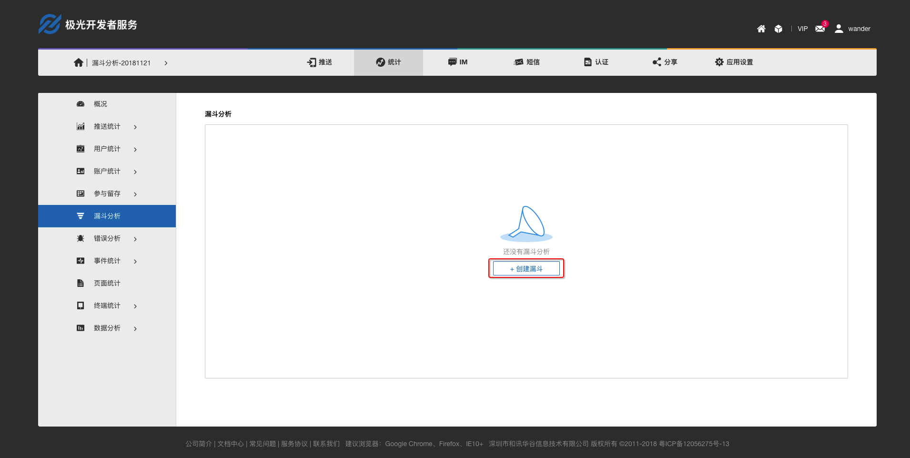
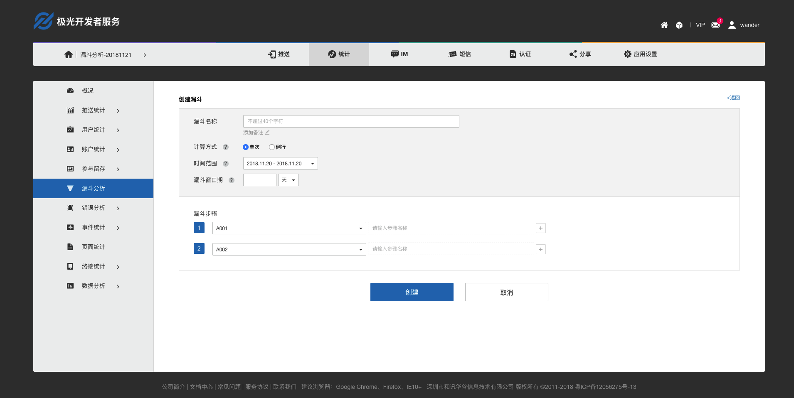
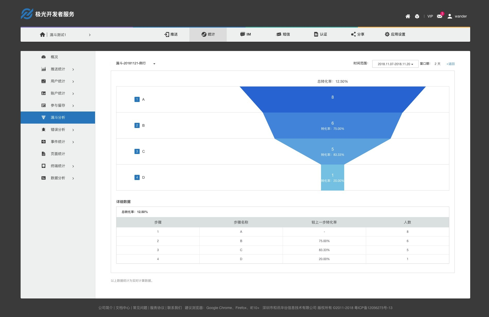

# 漏斗分析


##概述
开发者利用漏斗分析，可以充分了解用户在场景中的整体转化情况，以及多步骤过程中每一步的转化与流失。


## 功能介绍

进入极光管理控制台-统计，点击【漏斗分析】进入【创建漏斗】页面。




### 创建漏斗

点击页面中间「创建漏斗」按钮，进入创建页面。

```
友情提示：自定义事件中有事件才能创建相关漏斗。
``` 


填写漏斗详情，点击「创建」即保存成功。漏斗详情解释如下：

| 名称 |是否必填| 描述 |
|:-----------|:--------:|:--------------|
| 漏斗名称 | 必填项 |您可以给漏斗取一个方便管理的名称，漏斗不支持重名。 | 
| 计算方式 | 必填项 | 分单次、例行两种计算方式；单次：仅计算一次选定时间范围的数据。例行：每天计算选定时间范围的数据。 |   
| 时间范围 |  必填项 | 指该漏斗步骤发生的时间范围。|  
| 漏斗窗口期 |  必填项 | 指完成该漏斗的时间期限，即用户从第一个步骤到完成最后一步需要在指定窗口期完成，转化周期<=窗口期完成整个漏斗则记为有效转化，否则记作对应的事件转化流失。|
| 事件ID |  必填项 | 包含【事件统计】中自定义计算、自定义计数事件。 | 
| 步骤名称 | 非必填| 您可以给对应的漏斗步骤取一个别名。|
| 备注 | 非必填 | 您可以添加漏斗备注。 | 
	
### 漏斗分析详情
漏斗数据统计完成后，您可以在【漏斗列表】中找到具体的漏斗，查看分析详情。


漏斗详情中可以具体查看漏斗中相关上下步骤的转化以及漏斗总体转化情况。    
可以通过漏斗图上方的「漏斗名称」进行漏斗详情的切换。



	


## 漏斗计算逻辑说明

+ 假设一个漏斗包含 A、B、C、D 四个步骤，选择的时间范围是 2018 年 1 月 1 日到 2018 年 1 月 30 日，窗口期设定为1天，那么，只要A、B、C、D这四个步骤在所选择的时间范围内触发，并且步骤的发生顺序符合A - B - C - D，且需要满足 从A - D的完成时间小于等于 1 天，才认为该用户完成了一次成功的漏斗转化。
+ 如果用户发生的行为当中穿插了一些其他非定义为漏斗步骤的行为，如用户的行为顺序是 A - X - B - C - D ，X为非定义为漏斗步骤的用户行为，则仍然认为该用户完成了一次成功的漏斗转化。如果用户发生的行为顺序为 A - B - C - X ，X为非定义为漏斗步骤的用户行为，则认为该用户完成了 A - B - C 三个步骤，并未完成一个成功的漏斗转化，就算做C到D事件的流失了。


## FAQ

###漏斗个数有上限么？

每个应用最多可创建50个漏斗，计算方式为例行的漏斗最多可以创建10个。

###漏斗中时间范围和窗口期的关系

时间范围是指漏斗步骤发生时间的范围，窗口期是限制漏斗第一步到最后一步的时间范围，窗口期不能超过已选定的时间范围。